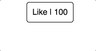
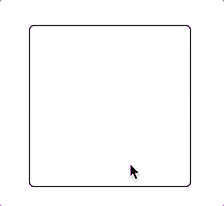

# React Case Study - Instructions

**Note**: this repo is also available on [GitHub](https://github.com/bnguyensn/react-case-study) should you want to work on it elsewhere.

## Packages installed

- Apart from the latest React library, the package [`clsx`](https://www.npmjs.com/package/clsx) is installed to help with manipulating CSS classes. However, you're free to use whatever method you're familiar with e.g. string template or some other packages.
- You shouldn't need to install further external packages for the exercises. However, feel free to discuss with the interviewer should you want to use something extra.

## 1. Like Button

Your task is to create a "Like" button that looks and behaves like the .gif
below:

### Details

- The like button component should have the "like-button" CSS class.
- The like count should start at 100. The button's inner text should be "Like | 100".
- When the button is clicked:
  - The like count should increase by 1 (i.e. to 101).
  - The like button component should have the CSS class "liked" in addition to having the CSS class "like-button".
- When the button is clicked again:
  - The button should revert to its original state. In essence, the like count should be 100 and the only CSS class should be "like-button".
- Stylings are provided in `src/components/like-button/like-button.css`. No additional stylings are required.

## 2. Color Box

Your task is to create a box that changes background color on click. Example behvaiour can be seen in the .gif below:

### Details

- The box component should have the "color-box" CSS class.
- When the box component is clicked, it should fetch a new random color from GitHub's color API. API details are provided in `src/components/color-box/ColorBox.js`.
- The box's background color should change to this new random color once it has been successfully fetched.
- Stylings are provided in `src/components/color-box/color-box.css`. No additional stylings are required.
